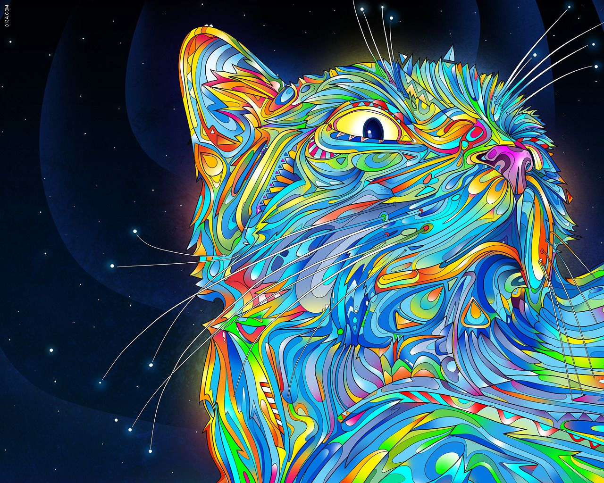
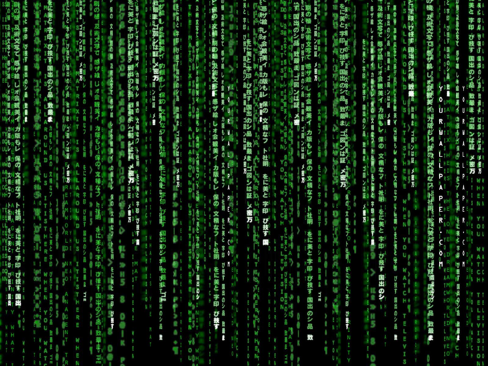
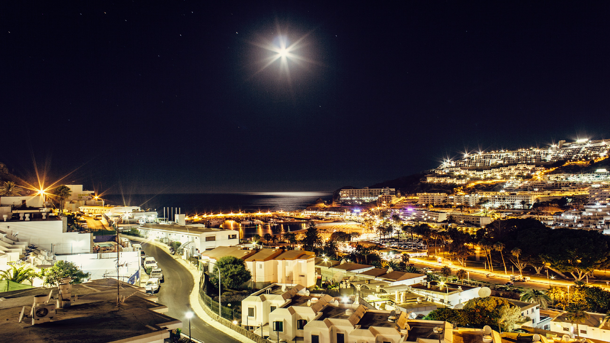
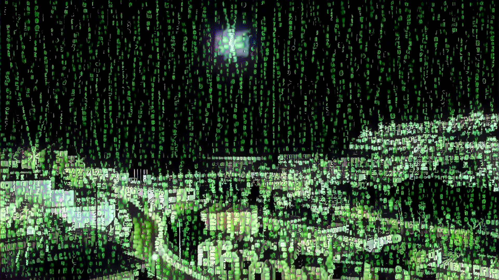
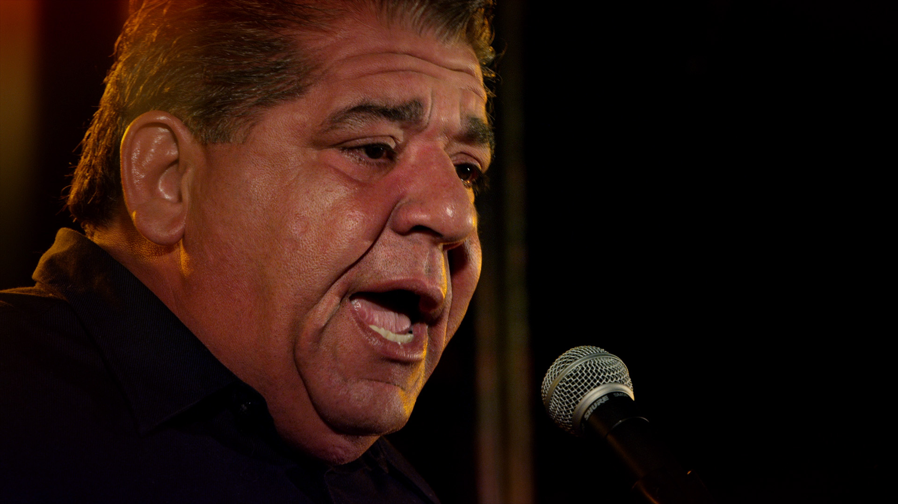
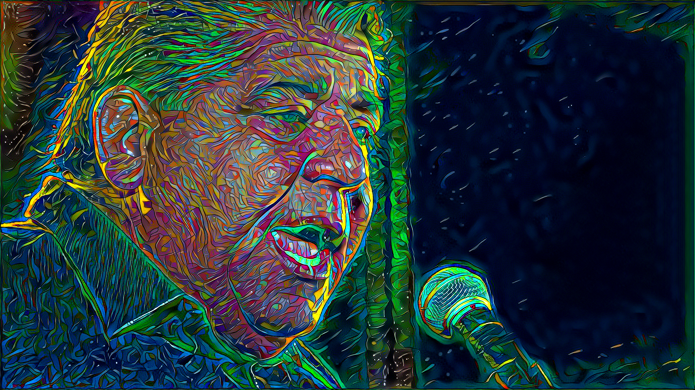
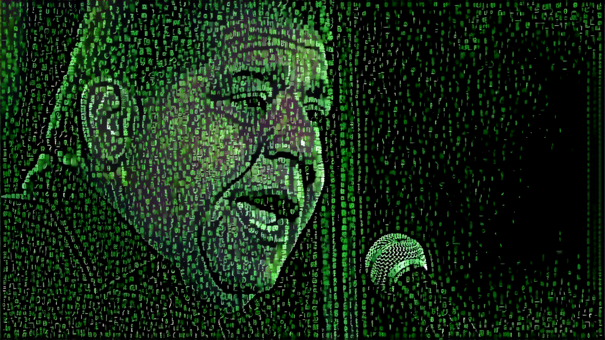
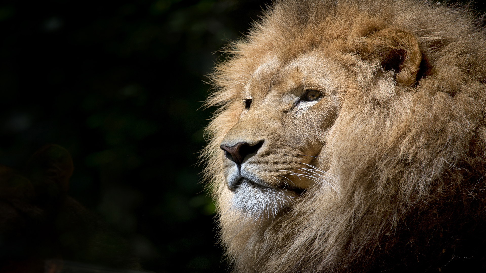
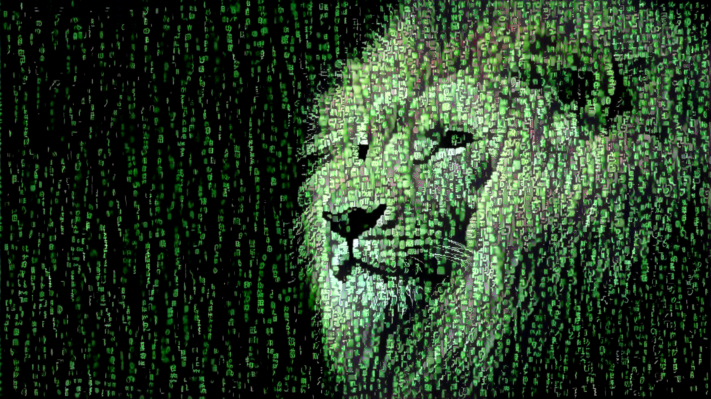

# Style Transfer as Optimal Transport 

Please click through images and download to see detail. 

<p float="right">

&nbsp;&nbsp;&nbsp;&nbsp;&nbsp;&nbsp;&nbsp;&nbsp;&nbsp;&nbsp;&nbsp;&nbsp;&nbsp;&nbsp;&nbsp;&nbsp;&nbsp;&nbsp;&nbsp;&nbsp;&nbsp;&nbsp;&nbsp;&nbsp;&nbsp;&nbsp;&nbsp;&nbsp;&nbsp;&nbsp;&nbsp;&nbsp;&nbsp;&nbsp;&nbsp;&nbsp;&nbsp;&nbsp;&nbsp;&nbsp;&nbsp;&nbsp;&nbsp;&nbsp;&nbsp;&nbsp;&nbsp;&nbsp;



</p>

<p float="left">





</p>

<p float="left">





</p>

<p float="left">






</p>


Currently a work in progress.. please stay tuned for updates
Let me know if you are interested in more explanation/theory behind this formulation. If there is interest, I will write this up formally. 

## An algorithm that transfers the distribution of visual characteristics, or style, of one image onto a second image via an [Optimal Transport](https://en.wikipedia.org/wiki/Transportation_theory_(mathematics)) plan. Implemented in [Tensorflow](https://github.com/tensorflow/tensorflow).

### Algorithm Overview - sections correspond to [synthesize.py](synthesize.py)
1. `get_style_desc`: A 'style' image is fed into the [vgg network](https://arxiv.org/pdf/1409.1556.pdf), which maps RGB-pixel values through a series of feature spaces calibrated to provide discriminatory information for an image classification engine. The dimensionality of the feature space grows from 3 colors (red, green, and blue) to 64, 128, 256, and eventually 512 abstract features ([visualizations](http://yosinski.com/deepvis)). Here, we conceptualize each pixel at a specific layer as a realization of a random vector with some distribution; for example, if an image is represented as a tensor of shape 100x100x128 (height x width x feature activations) this would be 10,000 realizations (or samples) of a 128 dimension vector. The first two moments (mean vector and covariance matrix) are observed empirically and stored as a representation of the style.* 

2. `infer_loss`: A 'subject' image is fed into the same network and the first two moments of the activations are calculated in an identical manner. The [L2-Wasserstein distance](https://en.wikipedia.org/wiki/Wasserstein_metric) between these parametrized distributions is used as a loss function. 

3. `scipy_optimizer` or `build_image`: An optimizer is invoked (either l-BFGS via scipy or Adam native to Tensorflow) to modify the subject image such that the distance between the distributions is minimized. 

*Note: Considering only the first two moments of the activations implicitly assumes the activations follow Gaussian distributions. 

## To do:

## Files:
[example.ipynb](example.ipynb) - notebook that demonstrates use case, output in [ipynb_example](/ipynb_example)

[vgg.py](vgg.py) - script that unpacks 'imagenet-vgg-verydeep-19.mat' found [here](https://github.com/anishathalye/neural-style) , citation below

[synthesize.py](synthesize.py) - synthesizes an image by transferring a 'style' onto a 'subject' image

[problems_gatys_fullEMD.ipynb](problems_gatys_fullEMD.ipynb) - illustrates problems with gatys loss function (frobenius norm of difference in Graham matrices) and calculations of computational intractability of full Earth Mover's distance. 

## Requirements: 

Need vgg network weights and biases, found: http://www.vlfeat.org/matconvnet/models/beta16/imagenet-vgg-verydeep-19.mat ((MD5 8ee3263992981a1d26e73b3ca028a123)
All testing done with tensorflow 1.3, python 3.5

README work in progress..


Source of vgg.py script:

```
@misc{athalye2015neuralstyle,
  author = {Anish Athalye},
  title = {Neural Style},
  year = {2015},
  howpublished = {\url{https://github.com/anishathalye/neural-style}},
  note = {commit xxxxxxx}
}
```
