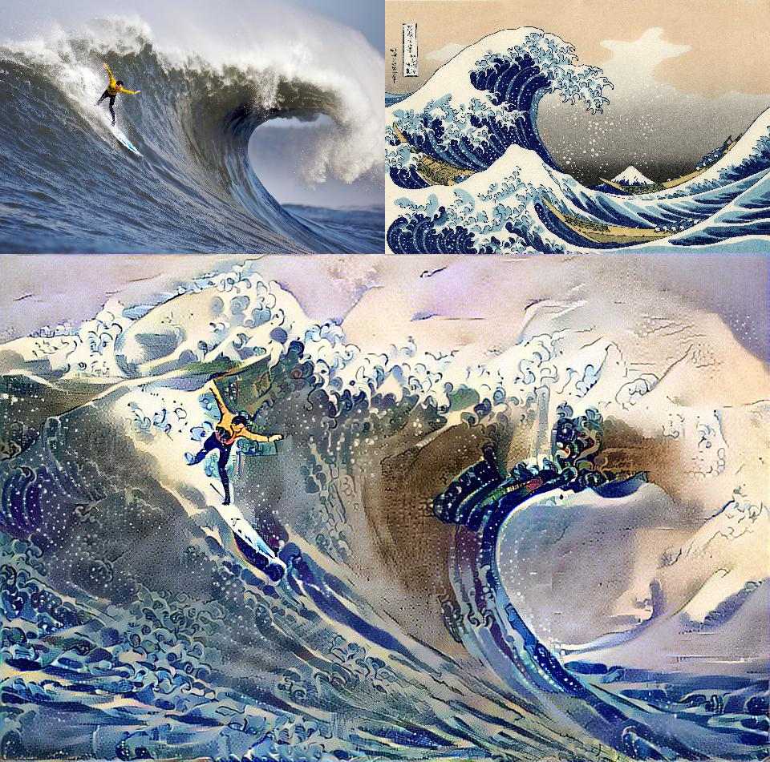
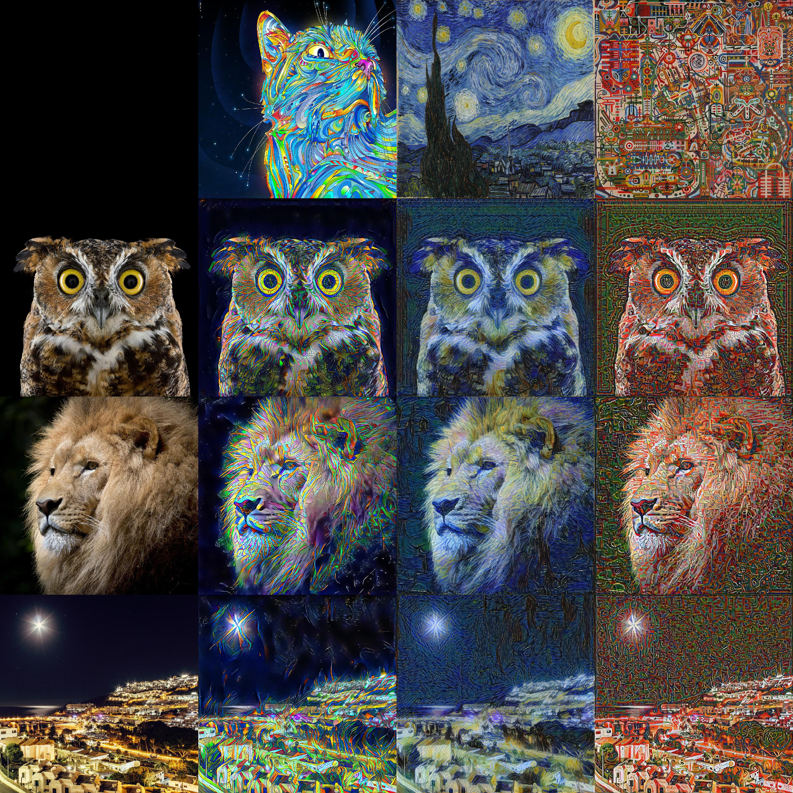

# Style Transfer as Optimal Transport 

## An algorithm that transfers the distribution of visual characteristics, or *style*, of a reference image onto a subject image via an Optimal Transport plan. 

>"What features and statistics are characteristics of a texture pattern, so that texture pairs that share the same features and statistics cannot be told apart by pre-attentive human visual perception?” -- [Bela Julesz](https://en.wikipedia.org/wiki/B%C3%A9la_Julesz)


# How it Works:

* For a general description and pictures: [style-transfer-theory.pdf](style-transfer-theory.pdf). 
* For an explanation of the use of L2-Wasserstein distance instead of the loss function from the [Gatys et. al](https://arxiv.org/abs/1508.06576) framework see [why_wasserstein.ipynb](why_wasserstein.ipynb). 


tl;dr - Passes a subject and style image through the convolution layers of the vgg19 network. Extracts probabalistic descriptions (first two moments) of the convolution filter activations. Calculates L2-Wasserstein distance between these probability distributions and then modifies the subject image optimally to minimize this distance.  

# Running

Requires:
 1. Python 3 (w/ NumPy and PIL)
 2. Tensorflow (tested w/ version 1.3)
 3. 'vgg_conv.npy' binary (115.5 MB) which contains calibrated convolution filters from vgg19 network. Can be [downloaded here](https://app.box.com/v/vgg19-conv-npy) [md5sum: bf8a930fec201a0a2ade13d3f7274d0e]

Basic Usage from Command Line:

```
python basic_styletrans.py --subject media/wave_small.jpg --style media/kngwa_small.jpg --output media/wave_kngwa.jpg --vggnet vgg_conv.npy
```
Output:
```
loss: 118,500,040.00
ALL DONE 
post clip | time: 49.0 final loss: 2,771,486.50
synthesized image saved: media/wave_kngwa.jpg
```




## Picture of Ben Bernanke transformed to represent selected styles


## Sample grid of subjects x styles

