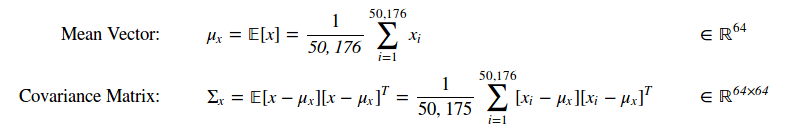
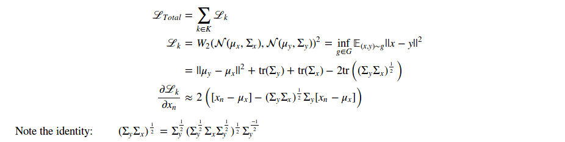

# Style Transfer as Optimal Transport 


## An algorithm that transfers the distribution of visual characteristics, or *style*, of a reference image onto a subject image via an Optimal Transport plan. Implemented in TensorFlow. 


# Running

Requires Python 3, Tensorflow (tested w/ 1.3), NumPy and PIL installed, as well as 'vgg_conv.npy' file (115.5 MB, contains calibrated convolution filters from vgg19 network) in parent directory. 

'vgg_conv.npy' can be downloaded [here](https://app.box.com/v/vgg19-conv-npy) [md5sum: bf8a930fec201a0a2ade13d3f7274d0e]

Basic Usage:

```
python basic_styletrans.py --subject media/wave_small.jpg --style media/kngwa_small.jpg --output media/wave_kngwa.jpg --vggnet vgg_conv.npy
```

```
loss: 118,500,040.00
ALL DONE 
post clip | time: 49.0 final loss: 2,771,486.50
synthesized image saved: media/wave_kngwa.jpg
```


# How it Works:

>"What features and statistics are characteristics of a texture pattern, so that texture pairs that share the same features and statistics cannot be told apart by pre-attentive human visual perception?” -- [Bela Julesz](https://en.wikipedia.org/wiki/B%C3%A9la_Julesz)

## 1. Digital Image -> CNN Feature Activations

We begin by extracting a description of the visual characteristics of an image from the activation responses observed in early layers of the [VGG image recognition network](https://arxiv.org/pdf/1409.1556.pdf). The VGG Network is a feed-forward Convolutional Neural Network (CNN) calibrated to classify images per [ImageNet2014](http://www.image-net.org/). It has two main modules:
 * A **Convolution Module** which scans digital image data on a section-by-section basis and quantifies wether certain features are present in each section. The first convolution layer maps 3x3 pixel sections of RGB values from the image on to a 64-dimension 'feature space', where each dimension measures the extent to which some feature, such as a *vertical edge that transitions red-to-blue*, is present. Subsequent convolution layers evaluate the feature activations from 3x3 spatial sections of preceding layers and map them onto increasingly abstract and higher dimension (up to 512) feature spaces. The feature mapping functions are convolution kernels calibrated via *back-propogation* of errors on the ImageNet classification task. At deeper layers, the features are abstract and difficult to interpret in words but they could quantify the extent to which a portion of an image contains something circular and wether this circle is more *face-*, *wheel-*, or *eye-like* ([good visualizations found here](http://yosinski.com/deepvis#toolbox)). 
 * A **Dense Module** which interprets the activations of the final 512-dimension feature space across the image and predicts a classification into one of the 1,000 Imagenet classes. 
 
Here, we are interested only in the *Convolution Module.* Let's say we have a 224x224x3 (height x width x Red-Green-Blue) image. We will run this image through the VGG model and extract the activations induced at each convolution layer. At the first layer the activation data would have shape 224x224x64 and provide basic descriptions of edges, hue, etc. for overlapping 3x3 (height x width) pixel sections of the original image. At deeper layers the field of view per activation is larger and the descriptions are more abstract (the spatial dimensions are also compressed by the use of pooling which means taking the maximum activation over 2x2 spatial regions of pixels - effectively *zooming-out*). At the final convolution layer the activations data would have the shape 14x14x512. 

Up to this point, this formulation is identical to that of Gatys et al. in [A Neural Algorithm of Artistic Style](https://arxiv.org/pdf/1508.06576.pdf), which was, to my knowledge, the original paper describing style transfer. That paper is very much worth a read and provides more context. Going forward, however, the methodology presented here will differ. 

## 2. Samples of Feature Space-> Distribution Parameters of Random Vector

We want to calculate a *distance* measure between the visual *styles* exhibited in a subject image and a style reference image and then modify the subject image, in accordance with the gradient of the distance measure with respect to RGB pixel values of our subject image, to minimize this distance. If the distance is well posed, minimizing it should cause the modified subject image's *style* to converge to that of the reference style. We accomplish this by thinking of a *style* as a probability distribution in the space of visual characteristics, or convolution feature activations, and calculating distances between these distributions.

Let's think of the feature activations induced by an image at a convolution layer as a collection of samples of a random vector. For our example image at the first layer, each sample would be a vector of 64 feature activations and we would have 224x224=50,176 samples. We disregard the spatial dimensions and treat these samples as unordered, independent and identically distributed. A non-parametric distance calculation becomes very computationally expensive (a full Earth Mover's Distance calculation between two sets of 50,176 samples in 64 dimensions would require 64x50,176^2 +50,176^3 =10^14 operations to evaluate) so we will proxy the distributions by inferring the first two moments, mean and covariance matrix, from the samples. Where **_x_** represents a vector of feature actiations at the first convolutional layer:

<p align = 'center'>

</p>

Assuming that a random vector's distribution is fully described by two moments is the same as assuming the random-vector is [multivariate Gaussian](https://en.wikipedia.org/wiki/Multivariate_normal_distribution). We now have a distribution 'object' which summarizes the visual characteristics or *style* exhibited in an image as a tractable Gaussian. We can compare it on an *apples-to-apples basis* with distributions extracted from images of any reasonable size and doing so is computationally tractable (64 + 64^2 = 4,160 parameters). 


## 3. Calculate Distance between Gaussians Fitted to *Subject*  and *Style Reference* and Modify the *Subject* to Minimize this Distance

We use the [*L^2-Wasserstein Metric*](https://en.wikipedia.org/wiki/Wasserstein_metric) between Gaussians parameterized by the moments of the feature activations induced by the subject and style reference image as our measure of *style-distance*. This metric can be calculated in closed form for Gaussians ([derivation](https://projecteuclid.org/download/pdf_1/euclid.mmj/1029003026) and [recent discussion](https://arxiv.org/pdf/0801.2250.pdf)). The random vector **_x_** will represent the feature activations from the subject image and **_y_** those from the style reference image. Where **K** is a set of selected convolutional layers and **G** is the set of all couplings of the distributions of **_x_** and **_y_** which preserve the respective distribution marginals, the loss function is expressed:

<p align = 'center'>

</p>


The formula represents the average L^2 norm of the difference between samples of random vectors **_x_** and **_y_** if a large number of samples of each were taken and paired optimally to minimize the average difference. It is a valid metric on Gaussian measures (whereas the loss function used in the Gatys et al, the Frobenius norm of the difference of Gram Matrices, violates the identity of indiscernibles, for example when x is zero mean with unit variance and y is a constant with value 1). The derivative of this loss function is the optimal transport plan describing how our subject image should be changed such that the distribution of visual characteristics matches that of our style image. The *approximately equal* in the derivative shown above becomes *equal* when the number of samples is large enough such that any single sample does not effect the mean or
